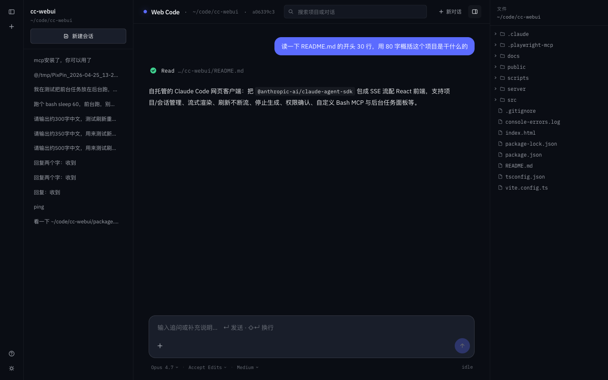
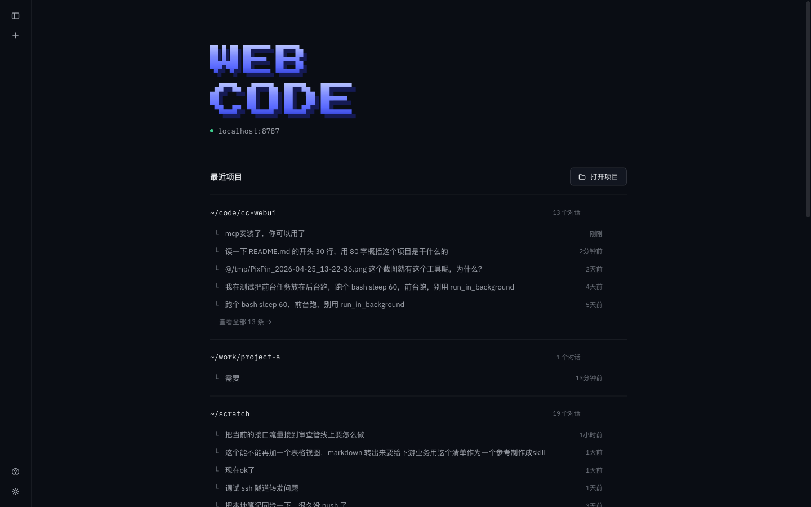

# cc-webui (Web Code)

一个自托管的 Code Agent 网页客户端。后端把 Claude Code SDK 和 Codex SDK 统一包成 SSE 流，前端用同一个工作台在浏览器里切换 provider、恢复会话和跟代码代理协作。



<details>
<summary>主页 / 最近项目</summary>



</details>

## 功能

- **项目管理** — 扫描 `$HOME` 列出所有候选目录，可搜索打开；最近项目按会话归类展示
- **会话恢复** — 直接打开 `~/.claude/projects/` 里已有的历史会话并继续聊
- **搜索** — Header 中央搜索框同时匹配 **最近项目路径** 和 **会话标题**（`summary / firstPrompt / customTitle`），↑↓ 键盘导航
- **流式渲染** — SDK 的 token 级 deltas、工具调用时间线、tool_result 结果
- **Provider 入口** — Composer 模型菜单里可在 Claude / Codex 之间切换；项目侧栏按当前 provider 分开列会话，主页和搜索里用小标签标识历史会话来源
- **多 agent 群聊** — 主页"新建群聊"创建一个把 Claude 和 Codex 拉到同一个会话里的群聊。Composer 输入 `@` 弹下拉选 `claude / codex / all`：
  - `@claude` / `@codex` — 单点对话，只让那一个 agent 回复
  - `@all`（或不带 @） — 流水线协作，按群聊配置的顺序依次跑（默认 Claude → Codex），下一个 agent 在 prompt 里看到上一个 agent 的发言以 `[来自 X 的回复]` 注入
  - 每个 agent 各自配 model / mode / effort / system prompt（角色设定）/ MCP，互不干扰
  - 群聊会话独立于单聊，canonical jsonl 落在 `~/.cc-webui/groups/<gid>/transcript.jsonl`，每次 SDK 调用都是 single-shot（不绑 native session resume），上下文由 cc-webui 现场组装
  - 权限请求按 agent 标注（`[Claude]` / `[Codex]`），允许 / 拒绝 / 本次会话允许 选项与单聊一致
- **刷新 / 切 session 不打断生成** — SDK 请求解耦于 HTTP 连接。回复到一半刷新页面或切到别的 session，后端继续跑到 turn 完整写到 jsonl；回来后自动 `attach` 续流，看到完整结果。多 tab 打开同 session 一起同步
- **停止生成** — 生成中，send 按钮变成红色 ■，点一下调 `response.return()` 立刻终止 SDK 迭代器。已经流出的文字保留在 UI，turn 不写 jsonl（和 ChatGPT / Claude.ai 的 Stop 语义一致）
- **侧边栏 in-flight 指示** — `ProjectSidebar` 每 3s 轮询 `/api/chat/inflight`，正在生成回复的 session 前面有个琥珀色脉冲点
- **Extended thinking** — 模型的思考内容以折叠块形式穿插显示，橙色 sparkle 图标 + 动词轮播（`Pondering / Thundering / Brewing / …`），Ctrl+O 全局展开
- **Tool-call 展开** — 点每一步查看完整 input / output
  - **Edit / Write / NotebookEdit** 走专用 diff 视图：`Update /path (+24 -1)`，红底 `−` / 绿底 `+` 分行展示
  - 其他工具 fallback 到通用 JSON / 文本视图
  - Step 图标区分三态：**等待审批**（静态虚线圈）/ **执行中**（蓝色转圈）/ **完成**（绿勾 / 红 X）
- **权限确认** — `permissionMode: default` 时每次工具调用弹琥珀色权限卡，三档：
  - `允许本次` —— 仅这一次
  - `本次会话都允许` —— 缓存到同 sessionId 的 `allowance` Set，后续同名工具直接放行，不再弹
  - `拒绝` —— 可附带拒绝理由回传给模型
  - 10 分钟无响应自动 deny
- **自定义 Bash MCP** — 内置 `Bash` / `BashOutput` / `KillBash` 三件套被 `disallowedTools` 禁用，换成同进程 `createSdkMcpServer` 提供的 `mcp__bash__run` / `mcp__bash__output` / `mcp__bash__kill`，整个后台任务注册表落在 Node 进程里，UI 可以直接驾驭
- **后台任务面板** — Composer 右侧琥珀色 `N shell` 计数器（对齐 CLI），点开 TasksModal 看所有任务：
  - 实时 stdout / stderr：**两条 SSE 流**（list 变更 + per-task 输出 chunk），非 polling
  - **256KB rolling 窗口**，满了从开头砍掉保留末尾（长跑任务的错误栈、exit 信息通常在末尾）
  - 一键 kill（SIGKILL）
  - 会话级隔离，每个 session 只看自己的任务
  - `tsx watch` 重启或收到 SIGTERM 时，所有 running 任务统一 SIGKILL，不漏孤儿 bash
- **Ctrl+B 前台→后台转移** — 前台 bash 卡着（`sleep 60` / 长编译 / `npm run test`）时按 Ctrl+B，同一个 proc + 已累积 buffer 原地搬进新建的 BackgroundTask，foreground Promise 立即 resolve 成 `Detached to bg-XXX...` 返回给模型，它不用等了可以继续做别的
- **文件浏览器** — 右侧栏显示 cwd 文件树，懒加载子目录，点文件以 `@relpath` 插入到 composer
- **文件上传** — composer 支持点击 / 拖拽 / 粘贴：
  - **图片** → base64 直接作为 image content block 发给模型，1 个回合看见（等价于终端粘贴）
  - **其他文件** → 落盘 `/tmp/cc-webui-uploads/`，路径以 `附件:` 形式带进 prompt，Claude 用 Read 访问
- **`@path` 原子删除** — composer 里 Backspace 到 `@path` 末尾时整段一次性删掉，不用逐字符退
- **模型 / 模式 / Effort** — 底栏直接选：
  - Claude：Opus 4.7 / Sonnet 4.6 / Haiku 4.5
  - Codex：GPT-5.3-Codex / GPT-5.1 Codex mini
  - 权限：Default / Accept Edits / Plan / Bypass
  - Effort：Low / Medium / High / xHigh / Max（不支持 `xHigh` 的模型会自动降到 High）
- **Markdown 渲染** — `react-markdown + remark-gfm`，支持标题 / 列表 / 表格 / 代码块 / 链接；中英混排下中文标点紧邻 URL 时自动分隔，autolink 不再吞中文；单 `~` 不会误触发删除线（`~~双~~` 才是）
- **日夜主题** — 左侧栏底部太阳/月亮按钮切换，配置保存在 localStorage
- **历史懒加载** — 首次打开一个会话只渲染最后 200 条消息，向上滚自动加更早

## 前置

- Node 20+
- 本机已安装并登录 `claude` CLI（`claude --version` 能通过）
- 使用 Codex provider 时，本机需要可运行 Codex CLI / `@openai/codex-sdk` 所需的 OpenAI 凭据

## Installation

### For Humans

把下面这段原样粘给你的 LLM agent（Claude Code / Cursor / 其他都行），让它替你把
项目跑起来 —— 路径参数你在它弹出的 `AskUserQuestion` 里选就好，不用手敲命令：

```
Install and configure cc-webui by following the instructions here:
https://raw.githubusercontent.com/KyrieXu11/cc-webui/main/docs/install.md
```

也可以翻 [安装指南](docs/install.md) 手动照做，但命令行手配 `PROJECT_DIR` /
`PORT` 参数容易打错，让 agent 来省事。

### For LLM Agents

拉指南照着跑：

```bash
curl -s https://raw.githubusercontent.com/KyrieXu11/cc-webui/main/docs/install.md
```

指南里会让你先用 `AskUserQuestion` 问用户两件事（项目目录、端口冲突策略），
再调 `scripts/deploy.sh` 完成 clone / 装依赖 / 启动 / 等就绪 / 反馈状态一整套。
脚本每一步都幂等，可重跑。

### For Manual

不想折腾 agent、不想跑脚本的话，三条命令手动来：

```bash
git clone https://github.com/KyrieXu11/cc-webui.git
cd cc-webui
npm install
```

```bash
# 一键起（生产模式，单端口 :8787）
npm start

# 或开发模式（vite :8787 前端 + api :8788，前端 HMR）
npm run dev
```

`npm start` 先 `vite build` 再用 Hono 同时托管 `dist/` 和 `/api/*`，
浏览器打开 http://localhost:8787 就能用。

## 环境变量

| 变量 | 含义 | 默认 |
|------|------|------|
| `PORT` | 服务端口 | `8787` |
| `CC_WEBUI_HOST` | 服务 bind 的 host；默认 IPv4 loopback。想放 LAN 用 `0.0.0.0` | `127.0.0.1` |
| `CC_WEBUI_CWD` | claude 的默认工作目录（UI 里也能切） | `process.cwd()` |
| `CC_WEBUI_UPLOAD_DIR` | 文件上传落盘目录 | `os.tmpdir()/cc-webui-uploads` |
| `CC_WEBUI_SESSION_INDEX` | WebUI 自己维护的 provider-aware session index（目前用于 Codex 历史） | `~/.cc-webui/sessions.json` |
| `CC_WEBUI_PERMISSION_TIMEOUT_MS` | 权限卡无响应时的超时（到时视为 deny） | `600000`（10 分钟） |
| `NODE_ENV` | `production` 时启用静态托管 | 由 `npm start` 设置 |

## 键盘快捷键

- `↵` — 发送消息
- `⇧↵` — 换行
- `Ctrl+B` — 把当前运行中的前台 bash 转成后台任务（无前台任务时忽略）
- `Ctrl+O` — 全局展开 / 收起所有 tool_call + thinking 详情
- `/` — 调出斜杠命令 / skill 菜单
- `Backspace`（光标在 `@path` 末尾） — 整段删除该引用，附带一个相邻空格
- `↑ ↓ ↵` — 在项目选择对话框 / header 搜索里导航
- `Esc` — 关闭弹窗 / 搜索下拉

对话框按钮：

- 蓝色 ↑ — 发送（未生成时）
- 红色 ■ — 停止当前生成
- `+` — 附加图片 / 文件（也支持粘贴 / 拖拽）

## 已知局限

- **单用户 / 无鉴权** — API 全部公开，适合本地或前置加一层鉴权（反代 + OAuth、Tailscale 之类）再用。裸暴露在公网会被利用上传 / 读写文件
- **非图片上传文件落在 `/tmp`** — 不在项目 cwd 里，Edit 修改不会进项目仓库。适合读、查、引用，不适合作为项目素材（图片走 inline 直接给模型，不受此限制）
- **Edit diff 不带真实行号 / 上下文** — 只显示 `old_string` → `new_string` 的纯变更行，没有读原文件去补上下文和真实行号
- **没有语法高亮** — 代码块和 diff 都是纯等宽黑字，暂未引入 shiki 等高亮库（bundle 体积考虑）
