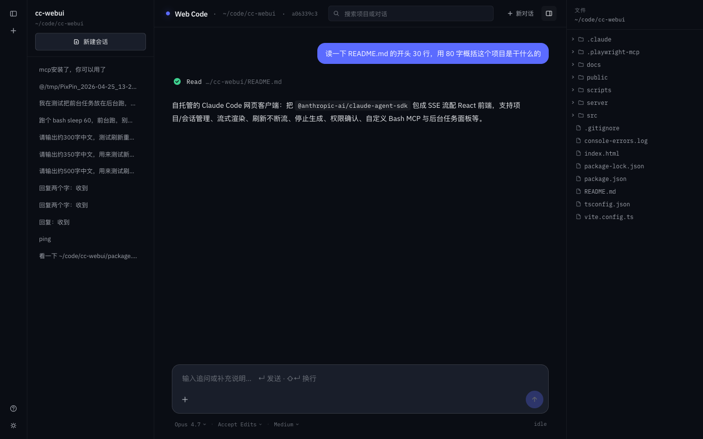
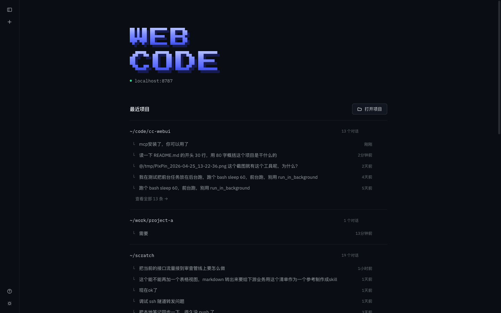

# cc-webui (Web Code)

一个自托管的 Code Agent 网页客户端。后端直接驱动本机的 `claude` / `codex` 两个 CLI，把它们的事件流统一包成 SSE；前端用同一个工作台在浏览器里切换 provider、恢复会话和跟代码代理协作。



<details>
<summary>主页 / 最近项目</summary>



</details>

## 功能

- **项目管理** — 扫描 `$HOME` 列出所有候选目录，可搜索打开；最近项目按会话归类展示
- **会话恢复** — 直接打开 `~/.claude/projects/` 里已有的历史会话并继续聊
- **搜索** — Header 中央搜索框同时匹配 **最近项目路径** 和 **会话标题**（`summary / firstPrompt / customTitle`），↑↓ 键盘导航
- **流式渲染** — CLI 的 token 级 deltas、工具调用时间线、tool_result 结果（Codex 侧没有 delta，一次回答一帧）
- **排队 / 中途插话** — 上一轮还在跑时照样能按回车。消息挂在输入框上方，并且**立刻塞进正在跑的那一轮**（服务端往 claude CLI 那根已经开着的 stdin 多写一行，CLI 自己带排队——它的会话 jsonl 里那条 `queue-operation / remove / absorbed_mid_turn` 记的就是这件事），所以不用等它跑完。插不进去的情形（Codex、带图、这一轮刚好结束）就留在队列里，这一轮结束后**逐条**自动发出。按「停止」不会丢掉排队的话，只是把队列冻住，顶上出一条「继续」。换会话 / 刷新即清空。群聊侧暂时没有
- **Provider 入口** — Composer 模型菜单里可在 Claude / Codex 之间切换；项目侧栏按当前 provider 分开列会话，主页和搜索里用小标签标识历史会话来源
- **多 agent 群聊** — 主页"新建群聊"创建一个把 Claude 和 Codex 拉到同一个会话里的群聊。Composer 输入 `@` 弹下拉选 `claude / codex / all`：
  - `@claude` / `@codex` — 单点对话，只让那一个 agent 回复
  - `@all`（或不带 @） — 流水线协作，按群聊配置的顺序依次跑（默认 Claude → Codex），下一个 agent 在 prompt 里看到上一个 agent 的发言以 `[来自 X 的回复]` 注入
  - 每个 agent 各自配 model / mode / effort / system prompt（角色设定）/ MCP，互不干扰
  - 群聊会话独立于单聊，canonical jsonl 落在 `~/.cc-webui/groups/<gid>/transcript.jsonl`，上下文由 cc-webui 现场组装（底下用隐藏的 native session resume 做 prompt 缓存）
  - 权限请求按 agent 标注（`[Claude]` / `[Codex]`），允许 / 拒绝 / 本次会话允许 选项与单聊一致
- **刷新 / 切 session 不打断生成** — CLI 子进程解耦于 HTTP 连接。回复到一半刷新页面或切到别的 session，后端继续跑到 turn 完整写到 jsonl；回来后自动 `attach` 续流，看到完整结果。多 tab 打开同 session 一起同步
- **停止生成** — 生成中，send 按钮变成红色 ■，点一下 abort 掉 CLI 子进程（SIGTERM）。已经流出的文字保留在 UI，turn 不写 jsonl（和 ChatGPT / Claude.ai 的 Stop 语义一致）
- **侧边栏 in-flight 指示** — `ProjectSidebar` 每 3s 轮询 `/api/chat/inflight`，正在生成回复的 session 前面有个琥珀色脉冲点
- **共享会话（仅管理员）** — 顶栏「共享」按钮（次要入口：侧边栏 hover 出现的人形图标，可作用于没打开的会话），勾选要共享给的账号。对方能读全部历史、也能在同一个会话里**接着聊**，但**删不掉、也不能再共享给别人**；他发的每个 turn 仍按他自己的账号算权限（目录白名单、权限卡、bash 护栏都不变）。同一个面板里还有「转交归属」——那是换主人，不是加读者。被共享进来的会话在列表里有一枚蓝色标记
- **Extended thinking** — 模型的思考内容以折叠块形式穿插显示，橙色 sparkle 图标 + 动词轮播（`Pondering / Thundering / Brewing / …`），Ctrl+O 全局展开
- **Tool-call 展开** — 点每一步查看完整 input / output
  - **Edit / Write / NotebookEdit** 走专用 diff 视图：`Update /path (+24 -1)`，红底 `−` / 绿底 `+` 分行展示
  - 其他工具 fallback 到通用 JSON / 文本视图
  - Step 图标区分三态：**等待审批**（静态虚线圈）/ **执行中**（蓝色转圈）/ **完成**（绿勾 / 红 X）
- **权限确认** — `permissionMode: default` 时每次工具调用弹琥珀色权限卡，三档：
  - `允许本次` —— 仅这一次
  - `本次会话都允许` —— 缓存到同 sessionId 的 `allowance` Set，后续同名工具直接放行，不再弹
  - `拒绝` —— 可附带拒绝理由回传给模型
  - 10 分钟无响应自动 deny
- **自定义 Bash MCP** — 内置 `Bash` / `BashOutput` / `KillBash` 三件套被 `disallowedTools` 禁用，换成同进程 `createSdkMcpServer` 提供的 `mcp__bash__run` / `mcp__bash__output` / `mcp__bash__kill`，整个后台任务注册表落在 Node 进程里，UI 可以直接驾驭
- **后台任务面板** — Composer 右侧琥珀色 `N shell` 计数器（对齐 CLI），点开 TasksModal 看所有任务：
  - 实时 stdout / stderr：**两条 SSE 流**（list 变更 + per-task 输出 chunk），非 polling
  - **256KB rolling 窗口**，满了从开头砍掉保留末尾（长跑任务的错误栈、exit 信息通常在末尾）
  - 一键 kill（SIGKILL）
  - 会话级隔离，每个 session 只看自己的任务
  - `tsx watch` 重启或收到 SIGTERM 时，所有 running 任务统一 SIGKILL，不漏孤儿 bash
- **Ctrl+B 前台→后台转移** — 前台 bash 卡着（`sleep 60` / 长编译 / `npm run test`）时按 Ctrl+B，同一个 proc + 已累积 buffer 原地搬进新建的 BackgroundTask，foreground Promise 立即 resolve 成 `Detached to bg-XXX...` 返回给模型，它不用等了可以继续做别的
- **文件面板** — 窗口右上角按钮打开（只在项目里有），显示 cwd 文件树、懒加载子目录：
  - 单击文件在右侧打开（文本可直接编辑，`.md` / `.html` 可切到渲染，Office 文档走 ONLYOFFICE）；⌘ / Ctrl + 单击是浮窗速览
  - 单击文件夹＝展开，同时设为「上传」「新建文件夹」的落点
  - 右键文件或文件夹进入多选 → 下载（多个打成 zip，文件夹不能下载）/ 删除（真删、无回收站、留痕；**文件夹只删空的**）
  - 拖到文件夹＝移动，拖到对话框＝插入相对路径；悬停出现的铅笔＝重命名
- **AI 共用项目记忆（可选）** — `CC_WEBUI_PROJECT_MEMORY_ENABLED=1` 后，网页 Claude / Codex 通过独立 Memory MCP 使用同一账号、同一项目的记忆。每轮加载索引，按需读取正文；保存会原子更新正文与索引，带版本冲突和幂等保护。左栏书本只展示这一份统一记忆；旧 Claude 记忆可用显式迁移脚本导入，原生文件不改动。Plan 禁止保存/删除；其它模式下五个范围固定的 memory 工具不另弹通用文件权限卡。详见 [项目记忆](docs/project-memory.md)
- **成员可用 AI** — 管理 → 用户：勾选允许 Claude / Codex，再设置默认 AI、该 AI 的模型和 effort。可用 AI 是服务端限制，默认值每版只套用一次，对方之后仍可自行调整模型/effort。普通账号默认仅 Claude，管理员可明确开放 Codex，不必升为管理员。**Codex CLI 没有逐工具确认通道，工具写入会自动执行；普通账号仍不能使用 Bypass。** 群聊仍只供管理员发起。
- **文件上传** — composer 支持点击 / 拖拽 / 粘贴：
  - **图片** → base64 直接作为 image content block 发给模型，1 个回合看见（等价于终端粘贴）
  - **其他文件** → 落盘系统临时目录下的 `cc-webui-uploads/`（macOS 上是 `/var/folders/…/T/`，可用 `CC_WEBUI_UPLOAD_DIR` 改），路径以 `附件：` 形式带进 prompt 让 Claude 去读；消息气泡里只显示文件名，悬停看路径。⚠️ **macOS 会自动清掉这个目录里 3 天前的文件**（`dirhelper`），要长期用的资料请用文件面板上传进项目
- **`@path` 原子删除** — composer 里 Backspace 到 `@path` 末尾时整段一次性删掉，不用逐字符退
- **模型 / 模式 / Effort** — 底栏直接选：
  - Claude：Opus / Fable / Sonnet / Haiku（**跟随最新**，CLI 自己解析成当前版本）+ **固定版本** Opus 5 / Opus 4.8 / Sonnet 4.6（不随升级变化）
  - Codex：GPT-5.6-Sol / GPT-5.6-Terra / GPT-5.6-Luna / GPT-5.5（仅管理员）
  - 权限：Default / Auto / Accept Edits / Plan / Bypass（Bypass 仅管理员）
  - Effort：Low / Medium / High / xHigh / Max（不支持 `xHigh` 的模型会自动降到 High）
  - 思考状态行里的「· xhigh effort」是**这一轮实际用的**档位，看别人正在跑的对话时也一样
  - **账号默认值（仅管理员）**：管理 → 用户里给某个账号设默认模型 / effort。是默认值不是限制——对方下次打开页面（或切回标签页）时换成你设的，之后自己改的会保留，直到你再保存
- **Markdown 渲染** — `react-markdown + remark-gfm`，支持标题 / 列表 / 表格 / 代码块 / 链接；中英混排下中文标点紧邻 URL 时自动分隔，autolink 不再吞中文；单 `~` 不会误触发删除线（`~~双~~` 才是）
- **日夜主题** — 左侧栏底部太阳/月亮按钮切换，配置保存在 localStorage
- **历史懒加载** — 首次打开一个会话只渲染最后 200 条消息，向上滚自动加更早

## 前置

- Node 20+
- 本机已安装并登录 `claude` CLI（`claude --version` 能通过）
- 使用 Codex provider 时，本机需要安装并登录 Codex CLI，普通账号还需管理员授予 Codex 使用权限

## Installation

### For Humans

把下面这段原样粘给你的 LLM agent（Claude Code / Cursor / 其他都行），让它替你把
项目跑起来 —— 路径参数你在它弹出的 `AskUserQuestion` 里选就好，不用手敲命令：

```
Install and configure cc-webui by following the instructions here:
https://raw.githubusercontent.com/KyrieXu11/cc-webui/main/docs/install.md
```

也可以翻 [安装指南](docs/install.md) 手动照做，但命令行手配 `PROJECT_DIR` /
`PORT` 参数容易打错，让 agent 来省事。

### For LLM Agents

拉指南照着跑：

```bash
curl -s https://raw.githubusercontent.com/KyrieXu11/cc-webui/main/docs/install.md
```

指南里会让你先用 `AskUserQuestion` 问用户两件事（项目目录、端口冲突策略），
再调 `scripts/deploy.sh` 完成 clone / 装依赖 / 启动 / 等就绪 / 反馈状态一整套。
脚本每一步都幂等，可重跑。

### For Manual

不想折腾 agent、不想跑脚本的话，三条命令手动来：

```bash
git clone https://github.com/KyrieXu11/cc-webui.git
cd cc-webui
npm install
```

```bash
# 一键起（生产模式，单端口 :8787）
npm start

# 或开发模式（vite :8787 前端 + api :8788，前端 HMR）
npm run dev
```

`npm start` 先 `vite build` 再用 Hono 同时托管 `dist/` 和 `/api/*`，
浏览器打开 http://localhost:8787 就能用。

## 环境变量

| 变量 | 含义 | 默认 |
|------|------|------|
| `PORT` | 服务端口 | `8787` |
| `CC_WEBUI_HOST` | 服务 bind 的 host；默认 IPv4 loopback。想放 LAN 用 `0.0.0.0` | `127.0.0.1` |
| `CC_WEBUI_CWD` | claude 的默认工作目录（UI 里也能切） | `process.cwd()` |
| `CC_WEBUI_CLAUDE_BIN` | `claude` CLI 的路径。留空 = 从 PATH 解析（跟随本机安装的版本）；填了就钉死那一个二进制——CLI 自动更新把事情弄坏时的逃生口 | 从 PATH 解析 |
| `CC_WEBUI_CODEX_BIN` | 同上，`codex` CLI | 从 PATH 解析 |
| `CC_WEBUI_UPLOAD_DIR` | 文件上传落盘目录 | `os.tmpdir()/cc-webui-uploads` |
| `CC_WEBUI_SESSION_INDEX` | 旧 Codex 会话索引文件路径，现仅用于首次启动时一次性导入进 SQLite | `~/.cc-webui/sessions.json` |
| `CC_WEBUI_DB` | SQLite 数据库路径（索引与关系：最近项目 / 飞书绑定 / 群聊索引 / Codex 会话索引） | `~/.cc-webui/cc-webui.db` |
| `CC_WEBUI_GROUPS_DIR` | 多 agent 群聊数据目录（`<gid>/config.json` + `transcript.jsonl` + `index.json`） | `~/.cc-webui/groups` |
| `CC_WEBUI_PROJECT_MEMORY_ENABLED` | 启用网页单聊的项目 Memory MCP；仅本次 CLI 调用禁用原生自动记忆，不改全局配置 | 关闭 |
| `CC_WEBUI_PROJECT_MEMORY_DIR` | 项目记忆正文库；只接受空目录或带本应用标记的目录，不可填现有项目/原生记忆目录 | `~/.cc-webui/project-memory` |
| `CC_WEBUI_GROUPS_ENABLED` | 是否启用**多 agent 群聊**（一个 turn 里多个 agent 接话）。未开启时网页群聊入口不出现、`/api/groups` 不挂载；飞书和网页单聊不受影响 | 关闭 |
| `CC_WEBUI_OFFICE_URL` | ONLYOFFICE DocumentServer 的**浏览器可达**地址（必须公网：是用户的浏览器去取 `api.js`）。**留空 = 在线编辑关闭**，取件台里 Office 文件降级成「浏览器打开 / 下载」 | 未设置（关闭） |
| `CC_WEBUI_OFFICE_JWT_SECRET` | 与容器 `JWT_SECRET` **必须一致**，否则容器一律拒签。同时用于签发容器取文件 / 回调的票据 | 未设置（关闭） |
| `CC_WEBUI_SELF_INTERNAL_URL` | **容器视角**的 cc-webui 地址（容器用它取原文件、发保存回调）。不要填公网——绕一圈 nginx+frp 只是慢且多一个失败点 | `http://host.docker.internal:8789` |
| `CC_WEBUI_CLIENT_DIR` | 桌面客户端安装包目录：放安装包 + 一个 `latest.json`（`{"version","file","notes"}`），`/api/meta` 据此下发 `desktopClient` 版本信息。目录里没有 `latest.json` = 没发布过，该字段整个不出现 | `~/.cc-webui/client` |
| `CC_WEBUI_PERMISSION_TIMEOUT_MS` | 权限卡无响应时的超时（到时视为 deny） | `600000`（10 分钟） |
| `NODE_ENV` | `production` 时启用静态托管 | 由 `npm start` 设置 |
| `FEISHU_CLAUDE_APP_ID` / `_APP_SECRET` / `_ENCRYPT_KEY` / `_VERIFY_TOKEN` | 飞书 Claude 机器人凭据（详见下面「飞书机器人」一节） | 未设置则不启用 |
| `FEISHU_CODEX_APP_ID` / `_APP_SECRET` / `_ENCRYPT_KEY` / `_VERIFY_TOKEN` | 飞书 Codex 机器人凭据；和 Claude bot 加到同一群时共享同一个 cc-webui group，@ 谁就路由到谁 | 未设置则不启用 |
| `FEISHU_MENTION_ALIASES` | 可选 JSON；给人或外部 bot 配置 @ 别名，例如 `{"alice":{"open_id":"ou_xxx","name":"Alice"}}`。已加载的 Claude/Codex bot 会自动注册别名 | 未设置 |
| `FEISHU_BASE_URL` | 飞书 OpenAPI base URL；Lark 国际版填 `https://open.larksuite.com` | `https://open.feishu.cn` |
| `CC_WEBUI_DOTENV` | `.env` 文件路径（用于 feishu 凭据） | 项目根目录 `.env` |

## 飞书机器人

把 cc-webui 接到飞书群里，用 @ 机器人触发 Claude / Codex agent —— 流式 markdown
回复、工具权限审批卡（Claude）、bot 主动发文件 / 图片 / @ 人或 bot、引用图片让 agent 看图。

**完整接入指南：[docs/feishu.md](./docs/feishu.md)**（约 15 分钟）。
飞书权限至少需要 `im:message`、`im:message:send_as_bot`、`cardkit:card:write`；
引用图片还需要 `im:resource`，列群成员用于主动 @ 人需要 `im:chat.members:read`
或 `im:chat:readonly`，调试 binding 可加 `im:chat:readonly`。

最小启动配置（飞书应用已建好、bot 已加入群）：

```env
FEISHU_CLAUDE_APP_ID=cli_xxx
FEISHU_CLAUDE_APP_SECRET=xxx
# 可选：再建一个飞书应用作为 Codex bot
# FEISHU_CODEX_APP_ID=cli_yyy
# FEISHU_CODEX_APP_SECRET=yyy
FEISHU_DEFAULT_CWD=/Users/yourname/code/myproj   # 可选；自动建会话用的默认目录
```

启动后日志看到 `[feishu claude channel] connected (bot=...)` / `[feishu codex channel] connected ...`
即可在群里 / 私聊 `@cc-webui-claude 你好` 或 `@cc-webui-codex 你好` 开始用。
常用命令清单见 docs/feishu.md。


## 键盘快捷键

- `↵` — 发送消息（上一轮还在跑时＝排队，跑完自动发出）
- `⇧↵` — 换行
- `⌘K` / `Ctrl+K` — 首页：跳到搜索框
- `Ctrl+B` — 把当前运行中的前台 bash 转成后台任务（无前台任务时忽略）
- `Ctrl+O` — 全局展开 / 收起所有 tool_call + thinking 详情
- `/` — 调出斜杠命令 / skill 菜单
- `Backspace`（光标在 `@path` 末尾） — 整段删除该引用，附带一个相邻空格
- `↑ ↓ ↵` — 在项目选择对话框 / header 搜索里导航
- `Esc` — 关闭弹窗 / 搜索下拉；文件面板里退出多选

对话框按钮：

- 蓝色 ↑ — 发送（未生成时）
- 红色 ■ — 停止当前生成
- `+` — 附加图片 / 文件（也支持粘贴 / 拖拽）

## 已知局限

- **单用户 / 无鉴权** — API 全部公开，适合本地或前置加一层鉴权（反代 + OAuth、Tailscale 之类）再用。裸暴露在公网会被利用上传 / 读写文件
- **非图片上传文件落在 `/tmp`** — 不在项目 cwd 里，Edit 修改不会进项目仓库。适合读、查、引用，不适合作为项目素材（图片走 inline 直接给模型，不受此限制）
- **Edit diff 不带真实行号 / 上下文** — 只显示 `old_string` → `new_string` 的纯变更行，没有读原文件去补上下文和真实行号
- **没有语法高亮** — 代码块和 diff 都是纯等宽黑字，暂未引入 shiki 等高亮库（bundle 体积考虑）
